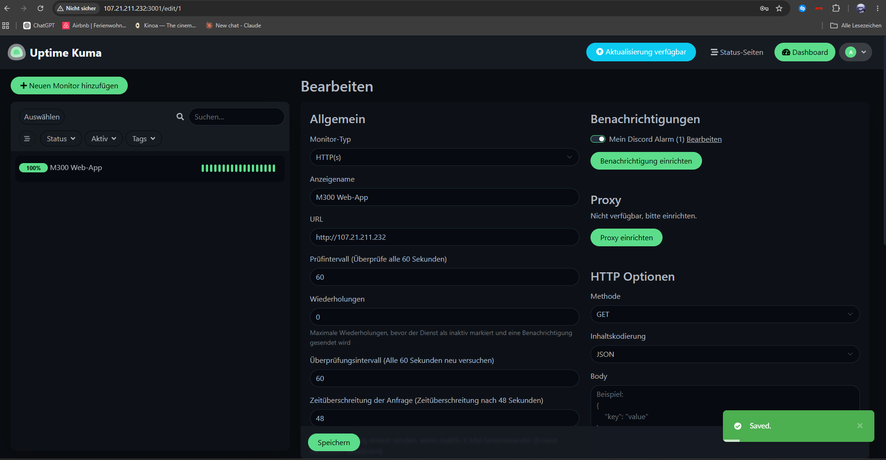
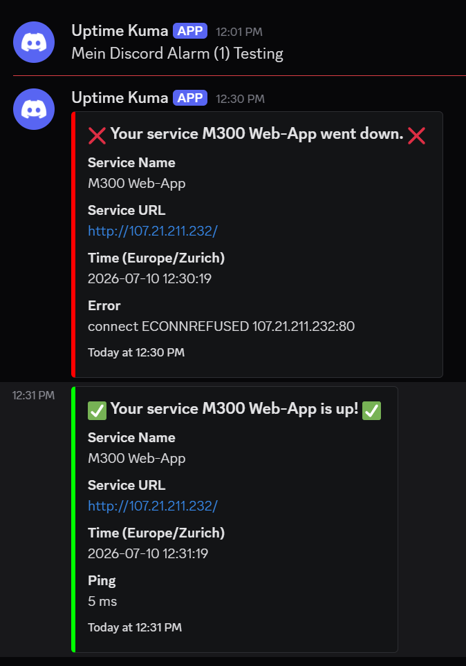

# Modul 300 V2 Cloud-Projekt

## 1. Einleitung
In diesem Projekt erstelle ich einen einfachen cloudbasierten Service auf AWS. Der Fokus liegt darauf, eine eigene Cloud-Infrastruktur aufzubauen, diese sauber zu dokumentieren und später mit weiteren Technologien wie Docker, CI/CD und Monitoring zu erweitern.

## 2. Ausgangslage
Im Modul 300 soll ein cloudbasierter Service eingerichtet und dokumentiert werden. Für die Variante V2 wird ein eigenes Projekt umgesetzt, bei dem neue Technologien praktisch eingesetzt werden. Dazu gehören in meinem Projekt AWS, Terraform, GitHub, Docker Compose und eine automatische Deployment-Lösung.

## 3. Projektziel
Ziel ist es, eine einfache Web-Applikation auf einer AWS EC2 Instanz bereitzustellen. Die Infrastruktur soll nicht nur manuell erstellt werden, sondern mit Terraform beschrieben und aufgebaut werden.

Umgesetzt habe ich: Terraform-Konfiguration für die gesamte AWS-Infrastruktur mit zentraler Variablenverwaltung (`variables.tf`), ein GitHub Repository mit vollständiger Versionierung, eine EC2-Instanz mit fester Elastic IP, eine containerisierte Web-Applikation mit Docker Compose, eine automatische CI/CD-Pipeline mit GitHub Actions sowie ein Monitoring- und Alarmierungs-Setup über AWS CloudWatch, Docker-Logs und Uptime Kuma mit Discord-Benachrichtigung.

## 4. Architektur

### 4.1 Geplante Architektur (Ausgangslage)

```
GitHub Repository -> Terraform Konfiguration -> AWS EC2 Instanz -> Docker Compose -> Web-App
```

### 4.2 Umgesetzte Architektur

```
                    ┌─────────────────────┐
                    │   GitHub Repository │
                    │   (main Branch)      │
                    └──────────┬───────────┘
                               │ git push
                               ▼
                    ┌─────────────────────┐
                    │  GitHub Actions      │
                    │  (deploy.yml)        │
                    │  - SSH Verbindung    │
                    └──────────┬───────────┘
                               │ SSH (Port 22)
                               ▼
        ┌──────────────────────────────────────────┐
        │        AWS EC2 Instanz (Terraform)        │
        │  ┌──────────────────────────────────┐    │
        │  │  Docker Compose                   │    │
        │  │  ┌──────────────────────────┐     │    │
        │  │  │  Container: m300-webapp   │     │    │
        │  │  │  nginx:alpine              │     │    │
        │  │  │  Port 80                  │     │    │
        │  │  └──────────────────────────┘     │    │
        │  │  ┌──────────────────────────┐     │    │
        │  │  │  Container: m300-monitoring│     │    │
        │  │  │  Uptime Kuma               │     │    │
        │  │  │  Port 3001                │     │    │
        │  │  └──────────────────────────┘     │    │
        │  └──────────────────────────────────┘    │
        │  Elastic IP: 107.21.211.232 (fest)         │
        │  Security Group: Port 22, 80, 3001         │
        └──────────────────┬─────────────────────────┘
                            │ HTTP (Port 80, 3001)
                            ▼
                     ┌─────────────┐
                     │   Nutzer/   │
                     │   Browser   │
                     └─────────────┘
                            │
                            ▼
          AWS CloudWatch + Uptime Kuma (Monitoring & Alarmierung)
                            │
                            ▼
                    Discord-Webhook (bei Downtime)
```

Die Infrastruktur (EC2-Instanz, Security Group, Key Pair, Elastic IP) wird vollständig über Terraform als Code definiert und ist damit nachvollziehbar und wiederholbar aufbaubar. Zentrale Konfigurationswerte (AMI, Instanztyp, Security-Group-ID) sind in `variables.tf` ausgelagert statt hartcodiert, was Änderungen an einer einzigen Stelle ermöglicht. Bei jedem Push auf den `main`-Branch verbindet sich GitHub Actions automatisch per SSH mit dem Server, holt den neuesten Code und startet die Web-Applikation sowie den Monitoring-Service über Docker Compose neu.

### 4.3 Netzwerkdiagramm

```
Internet
   │
   ├── Port 22 (SSH)  ──────────────► EC2-Instanz (Security Group sg-0f5f0eabbcc268057)
   │                                   Elastic IP: 107.21.211.232
   ├── Port 80 (HTTP) ──────────────►  ├── Container m300-webapp   (nginx:alpine, intern Port 80)
   │                                   └── Container m300-monitoring (Uptime Kuma, intern Port 3001)
   └── Port 3001 (HTTP) ─────────────►
```

| Port | Protokoll | Quelle | Ziel | Zweck |
|---|---|---|---|---|
| 22 | TCP/SSH | 0.0.0.0/0 | EC2-Instanz | Administrativer Zugriff & GitHub-Actions-Deployment |
| 80 | TCP/HTTP | 0.0.0.0/0 | Container m300-webapp | Öffentliche Web-Applikation |
| 3001 | TCP/HTTP | 0.0.0.0/0 | Container m300-monitoring | Uptime-Kuma-Dashboard |

### 4.4 Prozessdiagramm: CI/CD-Ablauf

```
[Entwickler]
     │  git push (main)
     ▼
[GitHub Repository] ──trigger──► [GitHub Actions Workflow]
                                        │
                                        ▼
                              SSH-Verbindung zur EC2-Instanz
                                        │
                                        ▼
                                  git pull origin main
                                        │
                                        ▼
                            docker compose up -d --build
                                        │
                          ┌─────────────┴─────────────┐
                          ▼                           ▼
              Container m300-webapp neu       Container m300-monitoring
              gebaut & gestartet              bleibt/läuft weiter
                          │
                          ▼
              Uptime Kuma prüft Erreichbarkeit
              (Heartbeat-Intervall)
                          │
                    ┌─────┴─────┐
                    ▼           ▼
                  "Up"        "Down"
                    │           │
                    ▼           ▼
             kein Alarm    Discord-Webhook-
                           Benachrichtigung
```

## 5. Anpassung zum ursprünglichen Plan
Ursprünglich war GitLab CI/CD geplant. Da ich aktuell mit GitHub arbeite, wird das Repository auf GitHub geführt. Die Projektdateien, die Dokumentation, die Terraform-Dateien und die Docker-Konfiguration werden dort versioniert, und die CI/CD-Pipeline wurde mit **GitHub Actions** statt GitLab CI/CD umgesetzt.

Anstelle einer rein manuellen AWS-Einrichtung wird Terraform verwendet, damit die Cloud-Infrastruktur nachvollziehbar und wiederholbar erstellt werden kann. Zusätzlich wurde im Projektverlauf eine **Elastic IP** eingeführt, die ursprünglich nicht fest eingeplant war. Der Grund: Bei jedem Neustart der EC2-Instanz änderte sich die Public IP-Adresse, was ständige Anpassungen an Secrets und Dokumentation nötig gemacht hätte. Mit einer festen Elastic IP bleibt die Adresse dauerhaft gleich.

## 6. Entscheidungsgrundlage: Warum EC2 + Terraform?

Für dieses Projekt standen grundsätzlich mehrere Ansätze zur Auswahl, um einen cloudbasierten Service umzusetzen:

| Option | Bewertung |
|---|---|
| **Manuelle AWS-Einrichtung über die Console** | Einfach für den Einstieg, aber nicht wiederholbar und nicht versionierbar. Fehleranfällig bei Wiederholung. |
| **EC2 + Terraform (gewählt)** | Infrastructure as Code: nachvollziehbar, versionierbar, reproduzierbar. Guter Kompromiss zwischen Kontrolle und Aufwand für ein Lernprojekt. |
| **Serverless (z. B. Lambda + API Gateway)** | Würde weniger Infrastruktur-Management erfordern, passt aber schlechter zu einer klassischen Docker-Compose-Web-App und bringt zusätzliche Komplexität bei der Umstellung. |
| **Kubernetes** | Bietet mehr Automatisierung (Skalierung, Self-Healing), ist aber für eine einzelne einfache Web-Applikation überdimensioniert und mit deutlich höherem Einrichtungsaufwand verbunden. |

Die Wahl fiel auf **EC2 kombiniert mit Terraform**, weil damit sowohl der Umgang mit klassischer Cloud-Infrastruktur als auch Infrastructure-as-Code-Prinzipien geübt werden konnten, ohne den Rahmen des Projekts zu sprengen.

### 6.1 Kosten, Effizienz und Skalierbarkeit

**Instanztyp:** Für die EC2-Instanz wurde bewusst `t2.micro` gewählt. Diese Instanzgrösse ist im AWS-Lab-Kontingent kostenlos bzw. im Free-Tier enthalten und bietet für eine einzelne, wenig frequentierte statische Web-Applikation mehr als ausreichend Rechenleistung. Die CloudWatch-Metriken (Kapitel 8) zeigen eine CPU-Auslastung von deutlich unter 1 %, was bestätigt, dass diese Instanzgrösse für den aktuellen Anwendungsfall passend dimensioniert ist.

**Skalierbarkeit:** Für dieses Projekt wurde bewusst **keine automatische Skalierung** (z. B. Auto Scaling Group, Load Balancer) umgesetzt. Begründung: Der Anwendungsfall (Lernprojekt mit einer einzelnen, statischen Web-Applikation) hat keinen schwankenden oder unvorhersehbaren Traffic, der eine horizontale Skalierung rechtfertigen würde. Eine Skalierungsstrategie wäre in einem produktiven Setting sinnvoll, würde hier aber unnötige Komplexität und Kosten verursachen, ohne einen praktischen Nutzen zu bringen.

**Flexibilität:** Durch die Verwendung von Docker Compose ist die Applikation grundsätzlich portabel und könnte ohne grössere Anpassungen auf eine andere Cloud-Plattform oder auf mehrere Instanzen verteilt werden. Die Terraform-Konfiguration mit ausgelagerten Variablen (`variables.tf`) erlaubt zudem, Instanztyp oder Region mit minimalem Aufwand anzupassen, falls sich die Anforderungen ändern.

## 7. Testfälle

Um die Funktionsfähigkeit der Infrastruktur und der Applikation sicherzustellen, wurden folgende **Integrationstests** durchgeführt – sie prüfen jeweils das Zusammenspiel mehrerer Komponenten (Netzwerk, Container, Pipeline) und nicht isolierte Code-Einheiten, was dem Charakter eines Infrastruktur-Projekts entspricht:

| Nr. | Testfall | Vorgehen | Erwartetes Resultat | Status |
|---|---|---|---|---|
| T1 | SSH-Verbindung zur EC2-Instanz | `ssh -i m300-key-new ubuntu@107.21.211.232` | Verbindung wird erfolgreich aufgebaut | ✅ erfolgreich |
| T2 | Terraform-Plan konsistent | `terraform plan` | Keine unerwarteten Ressourcenänderungen | ✅ erfolgreich |
| T3 | Docker Container läuft | `docker ps` auf dem Server | Container `m300-webapp` und `m300-monitoring` Status "Up" | ✅ erfolgreich |
| T4 | Web-App lokal erreichbar | `curl localhost:80` auf dem Server | HTTP-Antwort mit HTML-Inhalt | ✅ erfolgreich |
| T5 | Web-App öffentlich erreichbar | Browser-Aufruf `http://107.21.211.232` | Seite wird korrekt angezeigt | ✅ erfolgreich |
| T6 | CI/CD-Pipeline End-to-End | Code ändern, committen, pushen | GitHub-Actions-Run wird grün, Änderung erscheint automatisch auf dem Server | ✅ erfolgreich |
| T7 | Security Group Regeln | `aws ec2 describe-security-groups` | Port 22, 80 und 3001 korrekt konfiguriert | ✅ erfolgreich |
| T8 | Monitoring erkennt Ausfall | Container `m300-webapp` gestoppt (`docker stop`) | Uptime Kuma erkennt "Down"-Status nach einem Heartbeat-Intervall | ✅ erfolgreich |
| T9 | Alarmierung funktioniert | Container gestoppt, danach neu gestartet | Discord-Webhook sendet "Down"- und "Up"-Benachrichtigung | ✅ erfolgreich |

### 7.1 Nachweis: Web-Applikation läuft


Die Web-Applikation ist über die Public IP der EC2-Instanz im Browser erreichbar und zeigt den erwarteten Inhalt an.

### 7.2 Nachweis: CI/CD-Pipeline funktioniert


Zwei erfolgreiche Deployment-Durchläufe über GitHub Actions, ausgelöst automatisch durch `git push` auf den `main`-Branch. Jeder Durchlauf verbindet sich per SSH mit der EC2-Instanz, aktualisiert das Repository und startet die Docker-Container neu.

### 7.3 Wartungskonzept

Da es sich um ein einzelnes, containerisiertes System handelt, ist das Wartungskonzept bewusst schlank gehalten:

- **Updates:** Code-Änderungen werden über Git versioniert und durch die CI/CD-Pipeline automatisch ausgerollt. Ein Update erfordert lediglich einen `git push` auf den `main`-Branch.
- **Monitoring & Fehlererkennung:** Uptime Kuma überwacht die Erreichbarkeit der Web-Applikation fortlaufend und meldet Ausfälle sofort per Discord-Webhook, sodass zeitnah reagiert werden kann.
- **Infrastruktur-Änderungen:** Da die gesamte Infrastruktur über Terraform beschrieben ist, können Konfigurationsänderungen (z. B. Instanztyp) zentral in `variables.tf` vorgenommen und über `terraform plan`/`apply` kontrolliert ausgerollt werden.
- **Kein separates Backup-Konzept:** Da die Applikation zustandslos ist (keine persistenten Nutzdaten ausser der Uptime-Kuma-Konfiguration) und der gesamte Code in Git versioniert ist, kann der Zustand jederzeit aus dem Repository wiederhergestellt werden. Für die Uptime-Kuma-Daten (Docker-Volume) besteht aktuell kein automatisiertes Backup – dies wird als bekannte Einschränkung für ein produktives Setting festgehalten.

## 8. Monitoring

Für ein Basis-Monitoring wird AWS CloudWatch verwendet, das automatisch für jede EC2-Instanz aktiv ist. Es liefert unter anderem folgende Metriken:


Sichtbar sind CPU-Auslastung, ein- und ausgehender Netzwerkverkehr sowie CPU-Guthaben (relevant bei t2.micro-Instanzen, da diese ein begrenztes CPU-Guthabensystem verwenden). Zusätzlich wurden auf dem Server direkt der Container-Status (`docker ps`) und die Anwendungs-Logs (`docker compose logs`) überprüft, um den laufenden Betrieb der Web-Applikation zu kontrollieren.

### 8.1 Anwendungsmonitoring mit Uptime Kuma und Alarmierung

Zusätzlich zu CloudWatch wurde **Uptime Kuma** als zweiter Container über Docker Compose betrieben. Uptime Kuma überwacht die HTTP-Erreichbarkeit der Web-Applikation in einem festen Heartbeat-Intervall (60 Sekunden) und stellt den Status in einem Dashboard dar.



Für die Alarmierung wurde ein **Discord-Webhook** eingerichtet: Fällt die Web-Applikation aus, sendet Uptime Kuma automatisch eine "Down"-Benachrichtigung an einen Discord-Kanal; bei Wiederherstellung folgt eine "Up"-Benachrichtigung.



Getestet wurde dies, indem der Container `m300-webapp` gezielt gestoppt und wieder gestartet wurde (siehe Testfälle T8/T9). Wie im Screenshot ersichtlich, meldete Discord den Ausfall ("Your service M300 Web-App went down", inkl. Fehlermeldung `ECONNREFUSED`) und rund eine Minute später die Wiederherstellung ("Your service M300 Web-App is up!", Ping 5 ms).

Damit ist neben reinem Infrastruktur-Monitoring (CloudWatch) auch ein anwendungsnahes Monitoring mit aktiver Alarmierung vorhanden, sodass Ausfälle nicht erst bei manueller Prüfung auffallen, sondern aktiv gemeldet werden.

## 9. Sicherheitsaspekte

Für den Betrieb wurden folgende Security-Group-Regeln definiert:

- **Port 22 (SSH):** offen für alle IP-Adressen (`0.0.0.0/0`), da sowohl der Zugriff von wechselnden Arbeitsplätzen als auch von den dynamischen IP-Adressen der GitHub-Actions-Runner benötigt wird.
- **Port 80 (HTTP):** offen für alle IP-Adressen, da die Web-Applikation öffentlich erreichbar sein soll.
- **Port 3001 (HTTP):** offen für alle IP-Adressen, für den Zugriff auf das Uptime-Kuma-Dashboard.

**Bekannte Einschränkung:** Die offene SSH-Regel für `0.0.0.0/0` ist für ein produktives System nicht empfehlenswert. Eine sicherere Lösung wäre der Einsatz eines Bastion Hosts, von AWS Systems Manager Session Manager, oder die Einschränkung auf feste IP-Ranges (z. B. GitHub-Actions-IP-Ranges). Für den Rahmen dieses Lernprojekts wurde die offene Regel bewusst in Kauf genommen, um den Fokus auf Terraform, Docker und CI/CD zu legen. Ebenso ist das Uptime-Kuma-Dashboard aktuell nur durch den Login-Screen der Applikation selbst geschützt, nicht zusätzlich auf Netzwerkebene eingeschränkt.

### 9.1 Rollenkonzept

Dieses Projekt wurde als **Einzelprojekt** ohne Aufteilung auf mehrere Personen oder Rollen umgesetzt. Es gibt entsprechend keine unterschiedlichen Zugriffslevel oder Verantwortlichkeiten zu dokumentieren (z. B. Admin vs. Entwickler vs. Betrachter). Einzige Ausnahme ist der Login-Bereich von Uptime Kuma, der einen einzelnen Admin-Account verwendet.

## 10. Ergebnis und Fazit

Am Ende des Projekts steht eine vollständig funktionierende, automatisierte Cloud-Infrastruktur:

- Die gesamte AWS-Infrastruktur (EC2-Instanz, Security Group, Key Pair, Elastic IP) wird über **Terraform** als Code verwaltet, mit zentraler Konfigurationsverwaltung über `variables.tf`, und ist damit reproduzierbar.
- Die Web-Applikation läuft containerisiert über **Docker Compose** auf der EC2-Instanz und ist über eine feste Elastic IP dauerhaft erreichbar.
- Eine **CI/CD-Pipeline mit GitHub Actions** automatisiert das Deployment: Jede Codeänderung wird bei einem Push automatisch auf den Server ausgerollt, ohne manuellen SSH-Eingriff.
- Ein **mehrschichtiges Monitoring** über AWS CloudWatch (Infrastruktur), Docker-Logs (Container-Ebene) und **Uptime Kuma mit Discord-Alarmierung** (Anwendungsebene) erlaubt sowohl die Überwachung als auch die aktive Benachrichtigung bei Ausfällen.

Während des Projekts traten mehrere praxisnahe Probleme auf – unter anderem SSH-Key-Konflikte nach dem Neuaufbau der Instanz, eine veraltete `outputs.tf` mit irreführenden Werten, fehlerhafte Secret-Formatierung in GitHub Actions sowie zu restriktive Security-Group-Regeln. Jedes dieser Probleme wurde systematisch analysiert und gelöst; die Details dazu sind im `Arbeitsjournal.md` dokumentiert.

**Wichtigste Erkenntnis:** Cloud-Projekte bestehen nicht nur aus dem Aufsetzen eines Servers, sondern aus dem Zusammenspiel vieler Komponenten – Netzwerkkonfiguration, Zugriffsrechte, Versionierung, Automatisierung und Überwachung müssen sauber ineinandergreifen, damit ein System zuverlässig und wartbar funktioniert. Besonders die Einführung von aktiver Alarmierung (statt reinem passivem Monitoring) hat gezeigt, wie viel Unterschied es macht, ob ein Ausfall erst bei manueller Prüfung auffällt oder sofort gemeldet wird.
