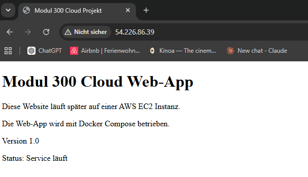
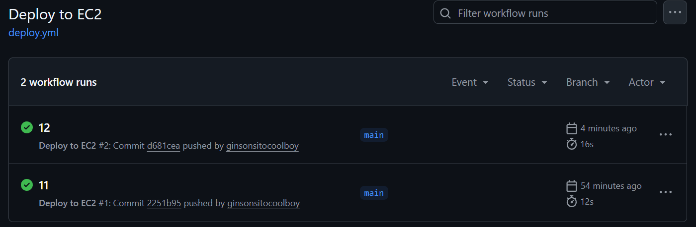
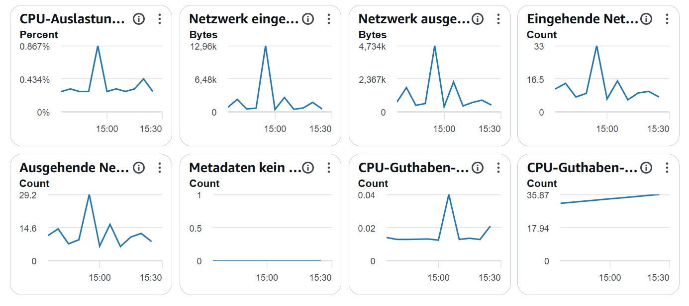

# Modul 300 V2 Cloud-Projekt

## 1. Einleitung
In diesem Projekt erstelle ich einen einfachen cloudbasierten Service auf AWS. Der Fokus liegt darauf, eine eigene Cloud-Infrastruktur aufzubauen, diese sauber zu dokumentieren und später mit weiteren Technologien wie Docker, CI/CD und Monitoring zu erweitern.

## 2. Ausgangslage
Im Modul 300 soll ein cloudbasierter Service eingerichtet und dokumentiert werden. Für die Variante V2 wird ein eigenes Projekt umgesetzt, bei dem neue Technologien praktisch eingesetzt werden. Dazu gehören in meinem Projekt AWS, Terraform, GitHub, Docker Compose und eine automatische Deployment-Lösung.

## 3. Projektziel
Ziel ist es, eine einfache Web-Applikation auf einer AWS EC2 Instanz bereitzustellen. Die Infrastruktur soll nicht nur manuell erstellt werden, sondern mit Terraform beschrieben und aufgebaut werden.

Umgesetzt habe ich: Terraform-Konfiguration für die gesamte AWS-Infrastruktur, ein GitHub Repository mit vollständiger Versionierung, eine EC2-Instanz mit fester Elastic IP, eine containerisierte Web-Applikation mit Docker Compose, eine automatische CI/CD-Pipeline mit GitHub Actions sowie ein Basis-Monitoring über AWS CloudWatch und Docker-Logs.

## 4. Architektur

### 4.1 Geplante Architektur (Ausgangslage)

```
GitHub Repository -> Terraform Konfiguration -> AWS EC2 Instanz -> Docker Compose -> Web-App
```

### 4.2 Umgesetzte Architektur

```
                    ┌─────────────────────┐
                    │   GitHub Repository │
                    │   (main Branch)      │
                    └──────────┬───────────┘
                               │ git push
                               ▼
                    ┌─────────────────────┐
                    │  GitHub Actions      │
                    │  (deploy.yml)        │
                    │  - SSH Verbindung    │
                    └──────────┬───────────┘
                               │ SSH (Port 22)
                               ▼
        ┌──────────────────────────────────────────┐
        │        AWS EC2 Instanz (Terraform)        │
        │  ┌──────────────────────────────────┐    │
        │  │  Docker Compose                   │    │
        │  │  ┌──────────────────────────┐     │    │
        │  │  │  Container: m300-webapp   │     │    │
        │  │  │  nginx:alpine             │     │    │
        │  │  │  Port 80                  │     │    │
        │  │  └──────────────────────────┘     │    │
        │  └──────────────────────────────────┘    │
        │  Elastic IP: 107.21.211.232 (fest)         │
        │  Security Group: Port 22, 80               │
        └──────────────────┬─────────────────────────┘
                            │ HTTP (Port 80)
                            ▼
                     ┌─────────────┐
                     │   Nutzer/   │
                     │   Browser   │
                     └─────────────┘
                            │
                            ▼
                  AWS CloudWatch (Monitoring)
```

Die Infrastruktur (EC2-Instanz, Security Group, Key Pair, Elastic IP) wird vollständig über Terraform als Code definiert und ist damit nachvollziehbar und wiederholbar aufbaubar. Bei jedem Push auf den `main`-Branch verbindet sich GitHub Actions automatisch per SSH mit dem Server, holt den neuesten Code und startet die Web-Applikation über Docker Compose neu.

## 5. Anpassung zum ursprünglichen Plan
Ursprünglich war GitLab CI/CD geplant. Da ich aktuell mit GitHub arbeite, wird das Repository auf GitHub geführt. Die Projektdateien, die Dokumentation, die Terraform-Dateien und die Docker-Konfiguration werden dort versioniert, und die CI/CD-Pipeline wurde mit **GitHub Actions** statt GitLab CI/CD umgesetzt.

Anstelle einer rein manuellen AWS-Einrichtung wird Terraform verwendet, damit die Cloud-Infrastruktur nachvollziehbar und wiederholbar erstellt werden kann. Zusätzlich wurde im Projektverlauf eine **Elastic IP** eingeführt, die ursprünglich nicht fest eingeplant war. Der Grund: Bei jedem Neustart der EC2-Instanz änderte sich die Public IP-Adresse, was ständige Anpassungen an Secrets und Dokumentation nötig gemacht hätte. Mit einer festen Elastic IP bleibt die Adresse dauerhaft gleich.

## 6. Entscheidungsgrundlage: Warum EC2 + Terraform?

Für dieses Projekt standen grundsätzlich mehrere Ansätze zur Auswahl, um einen cloudbasierten Service umzusetzen:

| Option | Bewertung |
|---|---|
| **Manuelle AWS-Einrichtung über die Console** | Einfach für den Einstieg, aber nicht wiederholbar und nicht versionierbar. Fehleranfällig bei Wiederholung. |
| **EC2 + Terraform (gewählt)** | Infrastructure as Code: nachvollziehbar, versionierbar, reproduzierbar. Guter Kompromiss zwischen Kontrolle und Aufwand für ein Lernprojekt. |
| **Serverless (z. B. Lambda + API Gateway)** | Würde weniger Infrastruktur-Management erfordern, passt aber schlechter zu einer klassischen Docker-Compose-Web-App und bringt zusätzliche Komplexität bei der Umstellung. |
| **Kubernetes** | Bietet mehr Automatisierung (Skalierung, Self-Healing), ist aber für eine einzelne einfache Web-Applikation überdimensioniert und mit deutlich höherem Einrichtungsaufwand verbunden. |

Die Wahl fiel auf **EC2 kombiniert mit Terraform**, weil damit sowohl der Umgang mit klassischer Cloud-Infrastruktur als auch Infrastructure-as-Code-Prinzipien geübt werden konnten, ohne den Rahmen des Projekts zu sprengen.

## 7. Testfälle

Um die Funktionsfähigkeit der Infrastruktur und der Applikation sicherzustellen, wurden folgende Tests durchgeführt:

| Nr. | Testfall | Vorgehen | Erwartetes Resultat | Status |
|---|---|---|---|---|
| T1 | SSH-Verbindung zur EC2-Instanz | `ssh -i m300-key-new ubuntu@107.21.211.232` | Verbindung wird erfolgreich aufgebaut | ✅ erfolgreich |
| T2 | Terraform-Plan konsistent | `terraform plan` | Keine unerwarteten Ressourcenänderungen | ✅ erfolgreich |
| T3 | Docker Container läuft | `docker ps` auf dem Server | Container `m300-webapp` Status "Up" | ✅ erfolgreich |
| T4 | Web-App lokal erreichbar | `curl localhost:80` auf dem Server | HTTP-Antwort mit HTML-Inhalt | ✅ erfolgreich |
| T5 | Web-App öffentlich erreichbar | Browser-Aufruf `http://107.21.211.232` | Seite wird korrekt angezeigt | ✅ erfolgreich |
| T6 | CI/CD-Pipeline End-to-End | Code ändern, committen, pushen | GitHub-Actions-Run wird grün, Änderung erscheint automatisch auf dem Server | ✅ erfolgreich |
| T7 | Security Group Regeln | `aws ec2 describe-security-groups` | Port 22 und 80 korrekt konfiguriert | ✅ erfolgreich |

### 7.1 Nachweis: Web-Applikation läuft



Die Web-Applikation ist über die Public IP der EC2-Instanz im Browser erreichbar und zeigt den erwarteten Inhalt an.

### 7.2 Nachweis: CI/CD-Pipeline funktioniert



Zwei erfolgreiche Deployment-Durchläufe über GitHub Actions, ausgelöst automatisch durch `git push` auf den `main`-Branch. Jeder Durchlauf verbindet sich per SSH mit der EC2-Instanz, aktualisiert das Repository und startet die Docker-Container neu.

## 8. Monitoring

Für ein Basis-Monitoring wird AWS CloudWatch verwendet, das automatisch für jede EC2-Instanz aktiv ist. Es liefert unter anderem folgende Metriken:



Sichtbar sind CPU-Auslastung, ein- und ausgehender Netzwerkverkehr sowie CPU-Guthaben (relevant bei t2.micro-Instanzen, da diese ein begrenztes CPU-Guthabensystem verwenden). Zusätzlich wurden auf dem Server direkt der Container-Status (`docker ps`) und die Anwendungs-Logs (`docker compose logs`) überprüft, um den laufenden Betrieb der Web-Applikation zu kontrollieren.

## 9. Sicherheitsaspekte

Für den Betrieb wurden folgende Security-Group-Regeln definiert:

- **Port 22 (SSH):** offen für alle IP-Adressen (`0.0.0.0/0`), da sowohl der Zugriff von wechselnden Arbeitsplätzen als auch von den dynamischen IP-Adressen der GitHub-Actions-Runner benötigt wird.
- **Port 80 (HTTP):** offen für alle IP-Adressen, da die Web-Applikation öffentlich erreichbar sein soll.

**Bekannte Einschränkung:** Die offene SSH-Regel für `0.0.0.0/0` ist für ein produktives System nicht empfehlenswert. Eine sicherere Lösung wäre der Einsatz eines Bastion Hosts, von AWS Systems Manager Session Manager, oder die Einschränkung auf feste IP-Ranges (z. B. GitHub-Actions-IP-Ranges). Für den Rahmen dieses Lernprojekts wurde die offene Regel bewusst in Kauf genommen, um den Fokus auf Terraform, Docker und CI/CD zu legen.

## 10. Ergebnis und Fazit

Am Ende des Projekts steht eine vollständig funktionierende, automatisierte Cloud-Infrastruktur:

- Die gesamte AWS-Infrastruktur (EC2-Instanz, Security Group, Key Pair, Elastic IP) wird über **Terraform** als Code verwaltet und ist damit reproduzierbar.
- Die Web-Applikation läuft containerisiert über **Docker Compose** auf der EC2-Instanz und ist über eine feste Elastic IP dauerhaft erreichbar.
- Eine **CI/CD-Pipeline mit GitHub Actions** automatisiert das Deployment: Jede Codeänderung wird bei einem Push automatisch auf den Server ausgerollt, ohne manuellen SSH-Eingriff.
- Ein **Basis-Monitoring** über AWS CloudWatch und Docker-Logs erlaubt die Überwachung von Systemzustand und Anwendungsverhalten.

Während des Projekts traten mehrere praxisnahe Probleme auf – unter anderem SSH-Key-Konflikte nach dem Neuaufbau der Instanz, eine veraltete `outputs.tf` mit irreführenden Werten, fehlerhafte Secret-Formatierung in GitHub Actions sowie zu restriktive Security-Group-Regeln. Jedes dieser Probleme wurde systematisch analysiert und gelöst; die Details dazu sind im `Arbeitsjournal.md` dokumentiert.

**Wichtigste Erkenntnis:** Cloud-Projekte bestehen nicht nur aus dem Aufsetzen eines Servers, sondern aus dem Zusammenspiel vieler Komponenten – Netzwerkkonfiguration, Zugriffsrechte, Versionierung, Automatisierung und Überwachung müssen sauber ineinandergreifen, damit ein System zuverlässig und wartbar funktioniert.
  , 
